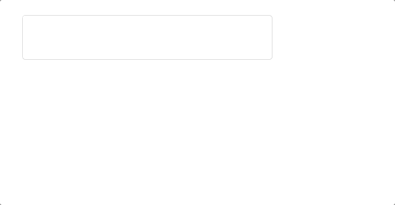
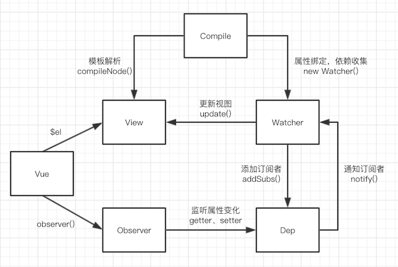
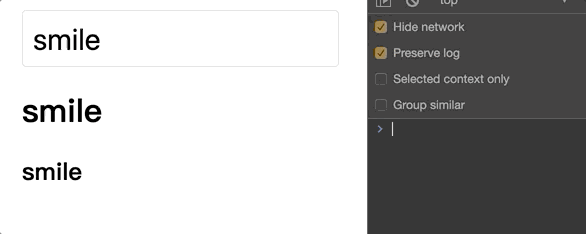

# Vue双向绑定原理及实现

虽然类似的文章已经很多了，但是我还是要写一篇博客来做个总结，也可以说是做个笔记？话不多说，直接开始。先上效果图：



## Object.defineProperty

Vue实现双向绑定的核心是`Object.defineProperty()`方法，它可以自定义属性的`setter`和`getter`，如此一来，我们就可劫持数据，在数据改变时，通过**发布——订阅**模式来更新视图。请看下面的例子

```javascript
const person = {}
Object.defineProperty(person, 'name', {
  get() {
    console.log(`get ${name}`)
    return name
  },
  set(newVal) {
    console.log(`set ${newVal}`)
    name = newVal
  }
})
person.name = 'smile' // 触发 set() 打印 set smile
person.name // 触发 get() 打印 get smile
```

上面的例子，通过`Object.defineProperty()`在对象`person={}`上定义了一个`name`属性，并且定义了它的`getter`和`setter`方法，如此一来，在改变`person`上的`name`的时候就会触发`setter`，在读取`person`上的`name`时就会触发`getter`。这时我们就可以在`setter`方法和`getter`方法中做一些事情，比如当属性发生变化时更新视图了。

说白了就是，给监听的数据定义`setter`并编写更新视图的方法，数据变化 -> 触发`set()` -> 变化后的值更新到视图

接下来，我们可以画出流程图，并根据流程图去实现：



## 监听器Observer和依赖收集

在知道如何通过`setter`方法**劫持数据**后，我们就可以开始实现了双向绑定了。

```javascript
const vm = new Vue({
  el: '#app',
  data: {
    name: 'smile'
  }
})
```

通过分析 Vue 实例的创建可以看到，在实例化时会传入一个对象，里面包括了`el`用于指定需要挂载的 DOM 节点，包括了`data`用于存储需要双向绑定的数据，因此我们需要定义一个 Vue 类，并在构造函数中传入`el`和`data`，此外还需要提供可供挂载的 DOM 节点。

```html
<div id="app"></div>
```

```javascript
// step0: 需要创建一个 Vue 类，并且在实例化时传入需要监听的属性，需要挂载的 DOM 节点位置
class Vue {
  constructor(options, prop) {
    this.$options = options
    this.$data = options.data
    this.$prop = prop
    this.$el = document.querySelector(options.el) // 获取需要挂载的视图模板

    observer(this.$data)  // step1: 对 data 中的属性逐一定义 setter 方法
  }
}
```

接下来，我们需要对`data`里的属性逐一定义`setter`方法，为了当属性发生变化时可以触发`setter`方法，通知视图更新。

```javascript
function observer(data) {
  // data 必须存在，而且是个 object 类型
  if (!data || typeof data !== 'object') {
    return
  }
  // 给 data 中的属性都定义 setter
  Object.keys(data).forEach(key => {
    defineReactive(data, key, data[key])
  })
}
```

接下来编写`defineReactive()`方法，这时我们要想，既然要通知视图更新，那么事先总得要收集需要更新的属性，因为我们的视图模板上可能会有多个属性，因此我们创建一个`Dep`来收集所有的**依赖**，并进行统一的管理

```javascript
class Dep {
  constructor() {
    this.subs = [] // 存储所有依赖
  }

  // 收集依赖
  addSubs(sub) {
    this.subs.push(sub)
  }

  // 通知视图更新
  notify() {
    console.log('监听的属性发生变化，触发视图更新')
    this.subs.forEach(sub => {
      // 通过调用依赖项 update() 方法来更新视图
      sub.update()
    })
  }
}
```

那么问题来了，我们应该在哪里收集依赖呢？在最上面的例子可以知道，当属性被读取时会触发`getter`，因此我们可以根据属性的`getter`方法来收集依赖。比如在视图模板中定义了两个`{{name}}`，那么在我们模板编译后获取到两个`name`属性，然后依次触发`name`属性的`getter`方法收集依赖，依赖项中包含了视图更新的回调。这样当数据变化触发`setter`后，就可以遍历所有依赖，并执行依赖的`update`方法来更新视图了。现在不明白没关系，等到最后就明白了。

```javascript
/**
  data 有可能是多级结构，所以需要递归的方式，给内层的 object 属性都定义 setter 方法
  data: {
    person: {
      age: 0,
      name: 'smile,
    }
  }
 */
function defineReactive(data, key, value) {
  observer(value) // value 可能还是一个 object
  const dep = new Dep()
  Object.defineProperty(data, key, {
    get() {
      // TODO: 这里进行依赖收集
      // dep.addSubs()
      return value
    },
    set(newVal) {
      if (value !== newVal) {
        value = newVal
        dep.notify()
      }
    }
  })
}
```

现在，我们就监听到属性的变化，并且触发视图更新的方法了

```javascript
let vm = new Vue({
  el: '#app',
  data: {
    name: 'smile'
  }
})

// 赋值触发 set() 方法，值发生改变，触发 notify() 方法
// 因此控制台打印：监听的属性发生变化，触发视图更新
vm.$data.name = 'laugh'

// 当 data 为多层级时

vm = new Vue({
  el: '#app',
  data: {
    person: {
      name: 'smile'
    }
  }
})

vm.$data.person.name = 'laugh'  // 同样可以触发 setter
```

## 订阅者Watcher

在上面的步骤中，已经解决了通过`setter`触发更新以及何时收集依赖的问题，现在我们就要定义订阅者 Watcher 去触发`getter`来进行订阅了。在每次实例化 Watcher 的时候通过`this.vm.$data[this.prop]`来触发`getter`进行依赖收集并保存当前的值。然后在 Watcher 中定义`update()`方法，当值发生变化后触发`setter`中调用`update()`方法执行更新视图的回调。

在有了订阅者 Watcher 后，通过`Dep.target = this`把当前 Watcher 保存到 Dep 中，并为了保证依赖只收集一次，需要在 Dep 的`get()`中判断存在`Dep.target`时保存 Watcher，保存之后马上把`Dep.target`置为`null`

```javascript
// Dep.target = null 确保 Dep 的 target 属性为空
class Dep {...}
Dep.target = null

// 改造 defineReactive() 中的 get()
get() {
  // 确保只收集一次
  if (Dep.target) {
    dep.addSubs(Dep.target)
  }
  return value
}

// 订阅者 Watcher
class Watcher {
  // vm 表示当前 Vue 实例
  // prop 表示需要订阅的属性
  // callback 表示触发更新时的回调函数，用于更新视图模板
  constructor(vm, prop, callback) {
    this.vm = vm
    this.prop = prop
    this.callback = callback
    this.value = this.get()
  }

  update() {
    const value = this.vm.$data[this.prop]
    const oldVal = this.value
    if (value !== oldVal) {
      this.value = value
      this.callback(value)
    }
  }

  get() {
    Dep.target = this // 储存订阅器
    const value = this.vm.$data[this.prop] // 触发 get 收集订阅器
    Dep.target = null
    return value
  }
}
```

此时每次执行`new Watcher()`时相当于：

```javascript
Dep.target = this // 储存订阅器
if (Dep.target) { // 确保只在实例化 Watcher 时收集订阅器
  dep.addSubs(Dep.target) // 收集订阅器
}
Dep.target = null // 把 target 置为空，避免后续触发 getter 时调用 addSubs() 方法
```

接下来就可以进行测试了：

```javascript
class Vue {
  constructor(options, prop) {
    this.$options = options
    this.$data = options.data
    this.$prop = prop
    this.$el = document.querySelector(options.el)

    observer(this.$data)

    // 把文本内容设置为初始化时的值
    this.$el.textContent = this.$data[this.$prop]

    // 实例化订阅器，订阅当前属性，当值变化时执行回调，更换文本内容
    new Watcher(this, this.$prop, value => {
      this.$el.textContent = value
    })
  }
}

const vm = new Vue({
  el: '#app',
  data: {
    name: 'smile'
  }
}, 'name')  // 第二个参数传入需要监听的属性 name

setTimeout(() => {
  vm.$data.name = 'laugh' // 两秒后浏览器显示的文本由 smile 变为 laugh
}, 2000)
```

到这里，就已经完成响应式核心代码的编写了，接下来就是解析模板，解析出模板中`{{name}}`并添加订阅者及更新函数，以及解析`v-model`等指令。

## 模板编译Compile

在这个例子中，我们需要解析的 HTML 模板如下：

```html
<div id="app">
  <input v-model="name" type="text">
  <h1>{{name}}</h1>
  <h2>{{name}}</h2>
</div>
```

在解析模板时，因为会频繁操作 DOM，因此借助文档片段([DocumentFragment](https://developer.mozilla.org/en-US/docs/Web/API/DocumentFragment))来优化性能

```javascript
class Compile {
  constructor(vm) {
    this.vm = vm
    this.el = vm.$el
    this.fragment = null
    this.init()
  }

  init() {
    // step0: 创建文档片段
    this.fragment = this.createFragment(this.el)
    // step1: 解析模板 
    this.compileNode(this.fragment)
    // step2: 把模板添加到 DOM 中
    this.el.appendChild(this.fragment)
  }

  createFragment(el) {
    const fragment = document.createDocumentFragment()
    let child = el.firstChild
    // 将子节点，全部 移动 文档片段里
    while (child) {
      fragment.appendChild(child)
      child = el.firstChild
    }
    return fragment
  }

  compileNode(fragment) {
    let childNodes = fragment.childNodes
    Array.from(childNodes).forEach(node => {
      if (this.isElementNode(node)) {
        this.compile(node)
      }

      // 把插值表达式中的属性匹配出来
      let reg = /\{\{(.*?)\}\}/
      let text = node.textContent

      if (reg.test(text)) {
        let prop = reg.exec(text)[1]
        this.compileText(node, prop) // 解析插值表达式
      }

      // 递归编译子节点
      if (node.childNodes && node.childNodes.length) {
        this.compileNode(node)
      }
    })
  }

  compile(node) {
    let nodeAttrs = node.attributes
    Array.from(nodeAttrs).forEach(attr => {
      let name = attr.name
      // 判断是否 Vue 指令
      if (this.isDirective(name)) {
        let value = attr.value
        if (name === 'v-model') {
          this.compileModel(node, value)
        }
      }
    })
  }

  // 编译 v-model
  compileModel(node, prop) {
    let val = this.vm.$data[prop]
    this.updateModel(node, val)

    // 添加订阅，传入视图更新回调
    new Watcher(this.vm, prop, (value) => {
      this.updateModel(node, value)
    })

    // 监听 input 事件
    node.addEventListener('input', e => {
      let newValue = e.target.value
      if (val === newValue) {
        return
      }
      // 如果值发生改变，触发 setter 并更新视图
      this.vm.$data[prop] = newValue
    })
  }

  compileText(node, prop) {
    let text = this.vm.$data[prop]
    // 把 {{name}} 替换为 name
    this.updateView(node, text)
    // 添加订阅，传入视图更新回调
    new Watcher(this.vm, prop, (value) => {
      this.updateView(node, value)
    })
  }

  updateModel(node, value) {
    node.value = typeof value === 'undefined' ? '' : value
  }
  
  updateView(node, value) {
    node.textContent = typeof value === 'undefined' ? '' : value
  }

  isDirective(attr) {
    return attr.includes('v-')
  }

  isElementNode(node) {
    return node.nodeType === 1
  }
}

class Vue {
  constructor(options, prop) {
    this.$options = options
    this.$data = options.data
    this.$prop = prop
    this.$el = document.querySelector(options.el)

    observer(this.$data)
    new Compile(this)
  }
}
```

在这个示例中，主要为了展示双向绑定原理，因此没有编译其它指令，以及对各种情况的处理，但是到这里，就已经足够我们理解双向绑定的原理，万变不离其宗。

## 数据代理

在最后，我们修改`data`中的数据时需要通过`vm.$data.name = 'smile'`来修改，我们想直接通过`vm.name = 'smile'`这样来直接修改数据，结合最开始的`Object.defineProperty()`方法，我们又可以做一层数据代理，把`vm.key`代理到`vm.$data[key]`上，如下代码所示：

```javascript
class Vue {
  constructor(options, prop) {
    this.$options = options
    this.$data = options.data
    this.$prop = prop
    this.$el = document.querySelector(options.el)

    Object.keys(this.$data).forEach(key => {
      this.proxyData(key)
    })

    observer(this.$data)
    new Compile(this)
  }

  proxyData(key) {
    Object.defineProperty(this, key, {
      get() {
        return this.$data[key]
      },
      set(value) {
        this.$data[key] = value
      }
    })
  }
}

const vm = new Vue({
  el: '#app',
  data: {
    name: 'smile'
  }
})
```



## 小结

- 监听器Observer：用来监听属性变化以及通知订阅者更新视图。
- 订阅者Watcher：触发依赖收集，执行视图更新。
- 模板编译Compile：初始化模板，解析指令，绑定订阅者。
- 这个示例只是为了学习，还有很多不完善的地方，[源码点我](https://github.com/smileShirmy/Mvvm)。
