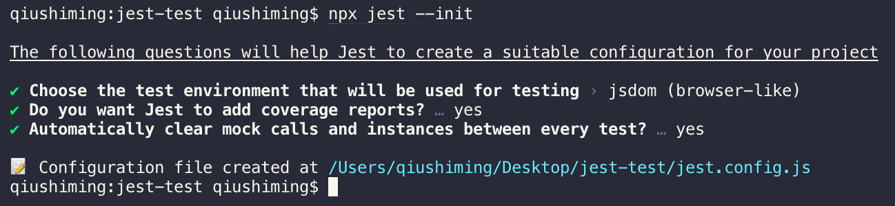
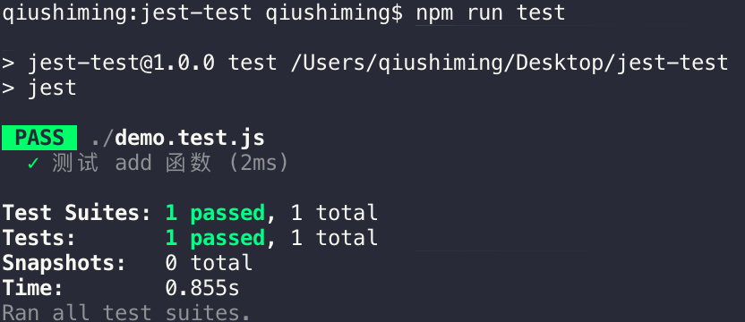
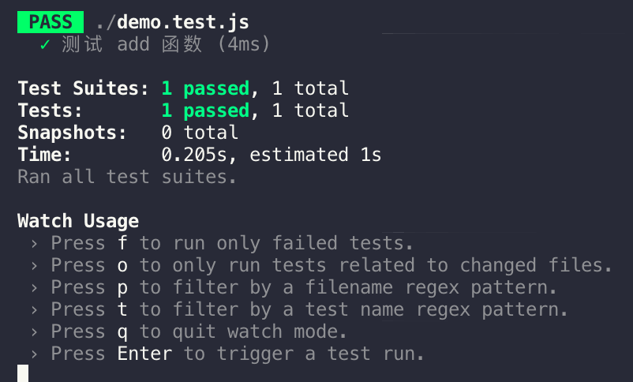

# Jest

Jest 是由 Facebook 推出的一个前端测试框架，具有许多非常好的特性，譬如执行速度快、API友好、自动监控、Snapshot、测试覆盖率、Mock等各种特性，并且适用于Babel、TypeScript、Node、React、Angular、Vue等。

# 安装

```bash
npm install jest -D

# 或者
yarn add --dev jest
```

进入项目，然后运行一下命令初始化`jest`配置

```bash
npx jest --init
```

接下会询问你构建的测试环境 node 环境 或 浏览器 环境，是否需要生成代码覆盖率报告，是否需要帮你做一些自动清除的事情，如下图：



此外，要使用 ES6 的`import`和`export`我们还需要另外配置Babel

```bash
npm install @babel/core @babel/preset-env -D

# 或
yarn add --dev babel-jest @babel/core @babel/preset-env
```

然后在项目根目录下新建 .babelrc 文件，配置需要哪些插件对代码做一些转换

```javascript
// .babelrc
{
  "presets": [
    [
      "@babel/preset-env", {
        "targets": {
          "node": "current" // 根据当前 node 环境
        }
      }
    ]
  ]
}
```

这时，我们在根目录下新建 demo.js 和 demo.test.js 文件来测试是否配置成功：

```javascript
// demo.js
export const add = (a, b) => {
  return a + b
}

// demo.test.js
import { add } from './demo'

test('测试 add 函数', () => {
  // 期望 add(1, 2) 结果为 3
  expect(add(1, 2)).toBe(3)
})
```

这时运行`npm run test`或直接运行`jest`，这时控制台就会显示测试情况：



至此，我们就成功配置 jest 的基础环境了

此外，如果使用 vscode，我们可以在插件搜 jest 安装相关插件辅助

## 单元测试 和 集成测试

- 单元测试，只对某个功能点进行测试
- 集成测试，对单元以及单元里面包含的其它东西统一的测试，包括其它的依赖

# Jest 常用匹配器

jest 提供了各种各样的匹配器来帮助我们判断测试结果是否为期望的结果

为了方便测试，我们可以使用 jest 的检测功能，当代码发生变动时就会重新进行测试

```bash
jest --watchAll
```

当我们使用`jest --watchAll`之后，jest 提供了多种命令行工具，在 watchAll 模式下按`w`



- `f`只测试失败的用例
- `o`只测试有代码变更的用例**需要配合git使用**，这样 jest 才能检测到变更
- `p`匹配测试文件名
- `t`匹配测试名
- `q`退出代码监控
- `a`测试所有用例
- `jest --watchAll`进入`a`模式
- `jest --watch`进入`o`模式

```javascript
// toBe() 类似于 object.is === 这种匹配
expect(1 + 1).toBe(2)

const obj = { a: 1 }
expect(obj).toBe(obj)

// toEqual() 用于判断值是否相等
expect([1, 2]).toEqual([1, 2])
expect(obj).toEqual({ a: 1})

// toBeNull() 判断是否为 null 只匹配 null
const n = null
expect(n).toBeNull()
expect(undefined).toBeNull()  // 测试不通过

// toBeUndefined() 只匹配 undefined
expect().toBeUndefined()

// toBeDefined() 是 toBeUndefined() 的反面
expect(null).toBeDefined()  // 通过

// toBeTruthy() 判断是否为 true
expect(true).toBeTruthy()

// expect().toBeFalsy() 判断是否为 false
expect(false).toBeFalsy()

// .not 取反
expect(true).not.toBeFalsy()

// Number 类型的判断
expect().toBeGreaterThan()  // 大于
expect().toBeLessThan() // 小于
expect().toBeGreaterThanOrEqual() // 大于等于
expect().toBeLessThanOrEqual()  // 小于等于
expect(0.1 + 0.2).toBeCloseTo(0.3)  // 这是为了解决 0.1 + 0.2 的情况

// String 类型
expect('hello world').toMatch(/hello/)  // 可以使用正则

// iterables 类型 Array Set
expect([1, 2]).toContain(1)

// 异常
expect(() => { throw new Error('error') }).toThrow()
```

# 测试异步代码

如果需要测试异步代码，需要告知 jest 该测试用例何时才完成，否则 jest 会忽略掉异步代码的测试

## 回调函数

```javascript
// 假如有一个 API 请求
// 需要传入 done 函数
test('测试 fetchData', (done) => {
  // 假如 fetchData 用于获取远程数据
  fetchData((data) => {
    expect(data).toEqual({ errorCode: 0, data: 123 })
    // 只有当 done() 执行了，测试才算完成
    done()
  })
})
```

## Promises

```javascript
test('测试 fetchData', () => {
  // 假如 fetchData 返回的是一个 Promise 直接 return 就可以了
  return fetchData().then((res) => {
    expect(res).toEqual({ errorCode: 0, data: 123 })
  })
})

test('fetchData 返回 404', () => {
  // 使用断言，确保 expect 必须执行一次
  expect.assertions(1)
  return fetchData().catch((e) => {
    // 捕获的异常中包含 404
    expect(e.toString().includes('404')).toBeTruthy()
  })
})
```

resolve 和 reject

```javascript
// resolve
return expect(fetchData()).resolves.toBe('success')

// reject
return expect(fetchData()).rejects.toMatch('error')
```

## async / await 语法

```javascript
test('测试 fetchData', async () => {
  const res = await fetchData()
  expect(res).toEqual({ errorCode: 0, data: 123 })
})

test('fetchData 返回 404', () => {
  expect.assertions(1)
  try {
    await fetchData()
  } catch (e) {
    expect(e.toString().includes('404')).toBeTruthy()
  }
})
```

resolve 和 reject

```javascript
// resolve
await expect(fetchData()).resolves.toBe('success')

// reject
await expect(fetchData()).rejects.toThrow('error')
```

# 钩子函数

```javascript
beforeAll(() => {
  // 在所有测试用例开始前需要做的工作
})

let counter
beforeEach(() => {
  // 保证每次执行都创建新的 Counter 实例
  // 避免不同测试用例之间产生影响 导致测试结果出现偏差
  counter = new Counter()
})

afterEach(() => {
  // 每个测试用例执行之后
})

afterAll(() => {
  // 在所有测试用例结束之后
})
```

jest 可以通过`describe`给代码生成作用域

```javascript
describe('测试 Counter', () => {
  describe('add 方法', () => {
    // ...
  })
  
  describe('minium 方法', () => {
    // ...
  })
})
```

如果存在 describe，执行顺序（[官方文档](https://jestjs.io/docs/en/setup-teardown)）如下：

```javascript
beforeAll(() => console.log('1 - beforeAll'))
afterAll(() => console.log('1 - afterAll'))
beforeEach(() => console.log('1 - beforeEach'))
afterEach(() => console.log('1 - afterEach'))
test('', () => console.log('1 - test'))
describe('Scoped / Nested block', () => {
  beforeAll(() => console.log('2 - beforeAll'))
  afterAll(() => console.log('2 - afterAll'))
  beforeEach(() => console.log('2 - beforeEach'))
  afterEach(() => console.log('2 - afterEach'))
  test('', () => console.log('2 - test'))
})

// 先执行外层的 beforeEach 再执行内层的 beforeEach

// 1 - beforeAll
// 1 - beforeEach
// 1 - test
// 1 - afterEach
// 2 - beforeAll
// 1 - beforeEach
// 2 - beforeEach
// 2 - test
// 2 - afterEach
// 1 - afterEach
// 2 - afterAll
// 1 - afterAll
```

使用`test.only()`方法可以只测试这一个用例

```javascript
test.only('only run', () => {})
```

# mock 方法

当我们传入回调函数时，我们需要测试回调函数是否被调用，并且测试之，这时我们就可以通过`jest.fn()`来创建一个 mock 函数

```javascript
// demo.js 假如有一个函数
export const runCallback = (callback) => {
  callback('params')
}

// demo.test.js
test('测试 callback', () => {
  // 创建一个 mock 函数
  // jest.nf() 可以捕获测试函数的调用和返回结果，以及 this 和 调用顺序
  const func = jest.fn()

  // 设置 mock 函数的返回结果
  func.mockReturnValueOnce('data')
  // 也可以链式调用
  // func.mockReturnValueOnce('one').mockReturnValueOnce('two')
  // 传入 mock 函数，如果这个 mock 函数被执行了，说明 runCallback() 方法没问题
  runCallback(func)
  // 期望 mock 函数被调用 1 次
  expect(func.mock.calls.length).toBe(1)
  // 期望 callback 回调函数第一个参数传入 'params'
  expect(func.mock.calls[0]).toEqual(['params'])
  // 可以打印 func.mock 查看内部的变量

  // 也可以用 toBeCalled() 确保回调被调用了一次
  expect(func).toBeCalled()
})
```

## mock Class

```javascript
// demo.js
// export const createClass = (classItem) => {
//   new classItem()
// }

// demo.test.js
test('测试 createClass', () => {
  const func = jest.fn()
  createObject(func)
  // func.mock.instance 指的是这个 func 的 this 指向
  // 指向 func 指向的 constructor
})
```

## mock axios

```javascript
// demo.js
export const fetchData = () => {
  return axios.get('/api').then(res => res.data)
}

// demo.test.js
import axios from 'axios';
jest.mock('axios')  // 让 jest 对 axios 做一个模拟

// 前端只要确认请求已经发送就可以了，返回的数据的正确性应该由服务端保证
test.only('测试 fetchData', async () => {
  // 改变函数的内部实现，让它同步的模拟数据
  axios.get.mockResolvedValueOnce({ data: 'hello world' })
  await getData().then((data) => {
    expect(data).toBe('hello world')
  })
})
```

## 手动 Mocks

[文档 Manual Mocks](https://jestjs.io/docs/en/manual-mocks)

我们可以通过创建一个`__mocks__`文件夹，里面写`mock`来替换真正的代码

比如我们有一个`fetchData()`方法获取数据

```javascript
// demo.js
import axios from 'axios'

export const fetchData = () => {
  return axios.get('/api').then(res => {
    res.data
  })
}
```

接下来我们要在根目录下创建一个`__mocks__`文件夹，并创建`demo.js`文件来编写模拟代码

```javascript
// __mocks__/demo.js
export const fetchData = () => {
  return new Promise(resolve => {
    resolve('success')
  })
}
```

然后编写测试用例

```javascript
// demo.test.js
// 模拟 demo
jest.mock('./demo')

// 下面这个方法可以取消模拟，然后就会调用根目录下真正的 demo.js
// jest.unmock('./demo')

import { fetchData } from './demo'

// 此时的 fetchData 会取 __mocks__ 下的 fetchData 方法
test('fetchData 测试', () => {
  return fetchData().then(data => {
    expect(data).toEqual('success')
  })
})
```

`jest.config.js`配置中的`automock`可以设置是否需要自动引入`mock`，默认为自动引入

如果测试文件下存在多个测试，使用了 mock，但是有部分测试用例需要取到真实的函数，而不是 mock 文件中的函数，那么可以使用以下方式：

```javascript
// 从真实的代码中取得方法
const { add } = jest.requireActual('./demo')
```

## Timer Mocks

如果我们需要 mock `setTimeout`,`setInterval`等方法，可以使用`jest.useFakeTimers()`方法，它可以帮助我们快进一段时间，而不必每次测试都需要等待

```javascript
// demo.js
export default (callback) => {
  setTimeout(() => {
    callback()
    setTimeout(() => {
      callback()
    }, 2000)
  }, 2000)
}

// demo.test.js
jest.useFakeTimers()

test('timer', () => {
  // 使用 mock 函数
  const fn = jest.fn()
  timer(fn)
  // 通过判断回调函数执行的次数进行判断
  jest.advanceTimersByTime(2000)  // 快进 2 秒
  expect(fn).toHaveBeenCalledTimes(1) // 函数被执行 1 次
  jest.advanceTimersByTime(2000)  // 再快进 2 秒
  expect(fn).toHaveBeenCalledTimes(2) // 函数被执行 2 次
})
```

如果测试中包含多个 timer 应当使用 beforeEach 钩子函数

```javascript
beforeEach(() => {
  jest.useFakeTimers()
})
```

# snapshot 快照测试

快照测试可以帮助我们判断代码是否发生了变更，常用在**DOM结构**和**配置文件**

假设有配置文件：

```javascript
// demo.js
export const generateConfig = () => {
  return {
    server: 'localhost',
    port: 8080,
    date: new Date()
  }
}
```

```javascript
// demo.test.js
test('测试 generateConfig 函数', () => {
  // 第一次执行测试的时候会生成 __snapshots__ 文件夹保存代码
  // 第二次会和之前的做匹配，如果不匹配则不通过
  // 如果更改了配置 并确定要这样改 按 w 再按 u 更新快照
  // 按 w 再按 i 可以逐个更新多个测试实例的快照 再按 u 逐个确定
  expect(generateConfig()).toMatchSnapshot({
    server: "localhost",
    port: 8080,
    // 因为 year 每次都会产生变化，因此可以使用以下这种方式
    // 只要一直是 Date 类型就可以，也可以是 String Number 等
    date: expect.any(Date)
  })
})
```

如果是不想生成`__snapshots__`文件夹，可以使用`Prettier`来使用内联快照

```javascript
// 内联快照
expect(generateAnotherConfig()).toMatchInlineSnapshot(
  {
    time: expect.any(Date)
  },
  `
    Object {
      "server": "localhost",
      "port": 8080,
      "time": Any<Date>,
    }
  `
);
```

# 测试 ES6 的类

```javascript
// Utils.js
export default class Util {
  add (a, b) {
    return a + b
  }
}

// demo.test.js
// 在所有测试开始前对实例化这个类
let util
beforeAll(() => {
  util = new Util
})

test('测试 Util 中的 add 方法', () => {
  expect(util.add(1, 2)).toBe(3)
})
```

## mock

```javascript
// Utils.js
export default class Util {
  add (a, b) {
    return a + b
  }
  minium (a, b) {
    return a - b
  }
}

// demo.js
import Util from './Util'

export default (a, b) => {
  const util = new Util()
  util.add(a, b)
  util.minium(a, b)
}

// demo.test.js
// 如果发现 Util 是一个类 会自动把类的构造函数和方法变成 jest.fn()
// 这样就达到模拟的方式，而不是真正地需要执行类中复杂的方法
// 模拟过后就可以判断 类 和 方法 是否被调用了
jest.mock('./Util')
import Util from './Util'
import utilFunction from './demo'

// 在单元测试中 我们更应该关注函数是否被调用 而不是函数中的复杂方法
// 因此使用 mock 方法来进行测试
test('测试 utilFunction', () => {
  utilFunction()
  expect(Util).toHaveBeenCalled() // Util 有被实例化
  expect(Util.mock.instances[0].add).toHaveBeenCalled() // add 方法有被执行
  expect(Util.mock.instances[0].minium).toHaeBeenCalled() // minium 方法有被执行
})
```

我还可以像之前说的一样，使用新建`__mocks__`文件夹的方式重新实现一遍方法

```javascript
// __mocks__/Util.js
const Util = jest.fn(() => {
  console.log('constructor')
})
Util.prototype.add = jest.fn(() => {
  console.log('add')
})
Util.prototype.minium = jest.fn(() => {
  console.log('minium')
})

// 当然也可以不新建文件夹
// demo.test.js
jest.mock('./Util', () => {
  const Util = jest.fn(() => {
  console.log('constructor')
  })
  Util.prototype.add = jest.fn(() => {
    console.log('add')
  })
  Util.prototype.minium = jest.fn(() => {
    console.log('minium')
  })
})
```

# 测试 DOM

测试 DOM 要记得把测试环境设为浏览器环境，jest 在底层模拟了一套 dom api

```javascript
// jest.config.js
{
  // testEnvironment: "node",
  testEnvironment: "jest-environment-jsdom",
}
```

```javascript
// demo.js
import $ from 'jquery'

export default () => {
  $('body').append('<div></div>')
}

// demo.test.js
import appendDiv from './demo'
import $ from 'jquery'

test('在 body 中添加 1 个 div', () => {
  addDivToBody()
  expect($('body').find('div').length).toBe(1)
})
```

# 小结

Jest 常用的方法大概就是上述这些

>  jest 官方文档
>
> [Jest](https://jestjs.io/)