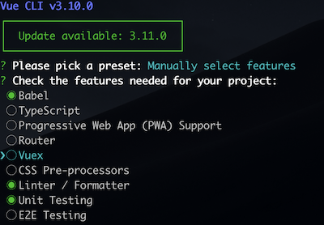

# 使用 Jest 对 Vue 进行自动化测试

在上一篇文章中，讲解了 Jest 的一些基本用法，理所当然的，我们应用到实际项目中，这里以 Vue 举例，介绍一些 Jest 在 Vue 开发中的基本用法。

## TDD vs BDD

在开始之前，我们需要先了解两种编写测试用例的方式，以便在实际开发中选取合适的方式。

### Test Driven Development (TDD) 测试驱动开发

TDD 的原理就是在编写代码之前先编写测试用例，由测试来决定我们的代码，而且 TDD 更多的需要编写独立的测试用例，比如只测试一个组件的某个功能点，某个工具函数等。它是白盒测试。

开发流程大致是：编写测试用例、运行测试、编写代码使测试通过、优化代码。

TDD 的优势：从长期来看，可以有效减少回归测试的 Bug；因为先编写测试，所以可能出现的问题都被提前发现了；测试覆盖率高，因为后编写代码，因此测试用例基本都能照顾到；保证代码质量。

TDD 的劣势：因为侧重点在于代码，更多是保证某个测试单元没问题，因此无法保证业务流程没有问题；而且需求经常变更，在修改某个功能点之前要先修改测试用例，因此在复杂的项目中工作量很大；测试代码和实际代码可能会出现耦合，经常需要修改。

### BDD (Behavior Driven Development) 行为驱动开发

BDD 是从产品角度出发，它鼓励开发人员和非开发人员之间的协作，是一种黑盒测试。

开发流程大致是：获悉需求并编写代码，然后再从用户角度编写集成测试。

BDD 的优势：它的测试重点更多是站在项目角度，在 UI 和 DOM 的角度进行测试，直接地测试业务流程是否没问题，测试代码和实际代码解耦。

BDD 的劣势：因为是集成测试，因此不是那么关注每个函数功能，测试覆盖率比较低，没有 TDD 那么严格的保证代码质量。

## Vue 中配置 Jest

在这里，直接借助了 [Vue CLI](https://cli.vuejs.org/) 工具来初始化项目，在初始化时会询问是否使用单元测试，我们只需要按照步骤选择，并选择 Jest 即可。



通过这种方式 Vue 会内置 [Vue Test Utils](https://vue-test-utils.vuejs.org/) 帮助我们进行测试

我们可以打开`package.json`文件修改`"test:unit": "vue-cli-service test:unit"`在后面加上`--watch`这样就只测试发生变动的文件

安装后，项目目录下会有一个`jest.config.js`文件，里面放的是 jest 相关的配置，我们可以根据自己的需要修改之

```javascript
module.exports = {
  // 依次找 js、jsx、json、vue 后缀的文件
  moduleFileExtensions: [
    'js',
    'jsx',
    'json',
    'vue'
  ],
  // 使用 vue-jest 帮助测试 .vue 文件
  // 遇到 css 等转为字符串 不作测试
  // 遇到 js jsx 等转成 es5
  transform: {
    '^.+\\.vue$': 'vue-jest',
    '.+\\.(css|styl|less|sass|scss|svg|png|jpg|ttf|woff|woff2)$': 'jest-transform-stub',
    '^.+\\.jsx?$': 'babel-jest'
  },
  // 哪些文件下的内容不需要被转换
  transformIgnorePatterns: [
    '/node_modules/'
  ],
  // 模块的映射 @ 开头到根目录下寻找
  moduleNameMapper: {
    '^@/(.*)$': '<rootDir>/src/$1'
  },
  // snapshot 怎么去存储
  snapshotSerializers: [
    'jest-serializer-vue'
  ],
  // npm run test:unit 时到哪些目录下去找 测试 文件
  testMatch: [
    '**/tests/unit/**/*.spec.(js|jsx|ts|tsx)|**/__tests__/*.(js|jsx|ts|tsx)'
  ],
  // 模拟的浏览器的地址是什么
  testURL: 'http://localhost/',
  // 两个帮助使用 jest 的插件 过滤 测试名/文件名 来过滤测试用例
  watchPlugins: [
    'jest-watch-typeahead/filename',
    'jest-watch-typeahead/testname'
  ]
}
```

为了方便，修改了`testMatch`的配置：

```javascript
  // 这条是自己新增的，测试 .vue 文件的测试覆盖率
  // vue-cli-service test:unit --coverage 可以生成测试覆盖率文件
  // 可以在 package.json 作如下配置
  // "test:coverage": "vue-cli-service test:unit --coverage"
  collectCoverageFrom: ['**/*.{vue}', '!**/node_modules/**'],
  testMatch: [
    // 进行测试时匹配 __tests__ 目录下的 js/jsx/ts/tsx 文件
    '**/__tests__/**/*.(js|jsx|ts|tsx)'
  ],
  // .eslintrc.js 不需要进行测试
  testPathIgnorePatterns: [
    '.eslintrc.js'
  ],
```

同时我们要明确开发的目录结构，好的目录组织可以帮助开发者更好的理解代码，以下是一种参考，当然可以有别的方式，只要组织得容易理解就好

```bash
├── App.vue
├── assets
├── components # 基础组件
├── views  # 项目主页面
│   └── Article # Article 页面
│       ├── ArticleHome.vue # Article 页面组件
│       ├── __mocks__
│       │   └── axios.js # 需要 mock 的文件
│       ├── __tests__ # 测试目录
│       │   ├── integration # 集成测试目录
│       │   │   └── Article.js
│       │   └── unit # 单元测试目录
│       │       └── store.js
│       └── components  # 页面子组件
│           ├── MyHeader.vue
│           └── MyFooter.vue
├── main.js
├── store.js # Vuex store
└── utils # 工具函数
```

下面介绍几种基础的用法，更详细的可以看官方文档

## 使用 Jest 测试 Vue 项目

### 判断 DOM 结构是否发生改变

Vue-test-utils提供的`shallowMount`可以帮助我们挂载组件，但它不挂载子组件，在组件单元测试中特别有用

另外`mount`方法则是把子组件也进行挂载

返回的`wrapper`包含了所测试组件的属性以及 vnode，我们可以借助它来测试 Vue

```javascript
import { shallowMount } from '@vue/test-utils'
import MyHeader from '../../components/MyHeader.vue'

// __test__/unit/MyHeader.js
it('提示 MyHeader 样式是否有发生变更', () => {
  const wrapper = shallowMount(MyHeader)
  expect(wrapper).toMatchSnapshot()
})
```

### input

为了获取 DOM，通常需要添加`data-test=""`属性来获取

我们可以编写一个`webpack plugin`在生成`production`环境代码的时候移除之

```html
<!-- MyHeader.vue -->
<input
  data-test="input"
  v-model="inputValue"
  @keyup.enter="add"
/>
```

```javascript
// __test__/unit/MyHeader.js

// 为了让代码看起来更清晰，我们可以使用 describe 包裹起来

describe('MyHeader 组件测试', () => {
  it('input 测试', () => {
    // 挂载 MyHeader 组件
    const wrapper = shallowMount(MyHeader)
    // 判断是否存在 input
    // wrapper.findAll('[data-test="input"]').at(0) 取第一个元素
    const input = wrapper.find('[data-test="input"]')
    expect(input.exists()).toBe(true)

    // input 一开始内容为空
    const inputValue = wrapper.vm.inputValue
    expect(inputValue).toBe('')

    // 模拟输入了内容
    input.setValue('name')

    // 模拟触发回车事件
    input.trigger('keyup.enter')

    // 模拟向外发送了一个 add 事件
    expect(wrapper.emitted().add).toBeTruthy()

    // 模拟回车之后内容为空
    expect(wrapper.vm.inputValue).toBe('')
  })
})
```

### 集成测试

相比于单元测试，集成测试从业务流程角度出发，同时测试多个组件，保证整个用户行为是没有问题的。

```javascript

it(`
  1. 在 input 输入框输入内容
  2. 点击回车按钮
  3. 增加用户输入内容的列表项
`, () => {
  const wrapper = mount(TodoList)
  const inputElem = wrapper.findAll('[data-test="input"]').at(0)
  const content = '今晚去踢波'
  inputElem.setValue(content)
  inputElem.trigger('change')
  inputElem.trigger('keyup.enter')

  // 这是从另外一个组件中获取的
  const listItems = wrapper.findAll('[data-test="list-item"]')
  expect(listItems.length).toBe(1)
  expect(listItems.at(0).text(0)).toContain(content)
})
```

### Vuex

#### 测试 Store

```javascript
import store from '../../../../store'

it('当 store commit change 时 value 发生变化', () => {
  const value = 'content'
  store.commit('change', value)
  expect(store.state.value).toBe(value)
})
```

#### 组件中

```javascript
// 在 mount 时把 store 传入，这样就能使用 store
const wrapper = mount(TodoList, { store })
```

### 异步测试

在组件挂载时，我们经常会加载远程数据来渲染页面，这样，渲染出来后的 DOM 就不是可以立即能获取的，因此应该这样测试：

```javascript
// 因为使用到 nextTick，因此需要传入 done 参数
it(`
  1. 用户打开页面时，请求远程数据
  2. 页面渲染远程数据
`, (done) => {
  const wrapper = mount(TodoList, { store })

  // 只需要稍有延迟就能取到数据
  wrapper.vm.$nextTick(() => {
    // 此时可以获取到渲染后的 DOM
    const listItems = wrapper.findAll('[data-test="list-item"]')
    expect(listItems.length).toBe(2)
    // 当 done 被执行才结束测试
    done()
  })
})
```

#### mock 和 timer

假如我们使用了 axios，我们可以使用手动 mock 的方式，不用真正地请求数据，而是重写获取数据的实现，这样可以省去每次远程获取数据的时间。

```javascript
// __mocks__/axios.js
const response = {
  errorCode: 0,
  data: [{ id: 0, name: 'name' }]
}

export default {
  get () {
    if (url === '/getData') {
      return new Promise((resolve, reject) => {
        if (this.errorCode === 0) {
          resolve(response)
        } else {
          reject(new Error())
        }
      })
    }
  }
}

// TodoList.vue
mounted() {
  setTimeout(() => {
    axios.get('/getData').then((res) => {
      this.data = res.data
    }).catch(e => {
      
    })
  }, 5000)
}
```

通过上面的 mock，当我们请求`/getData`接口时就会先找到 mock 中模拟的请求，并返回模拟请求的中的数据

接下来就可以直接在测试中使用了，在这里再加了一个 5s 的延时，以演示如何测试有 timer 的情况

```javascript
// 对 setTimeout 的统计都清零，避免测试之间相互影响
// 进入导致 toHaveBeenCalledTimes 得不到预期值
beforeEach(() => {
  jest.useFakeTimers()
})

it(`
  1. 用户打开页面时，等待 5s，然后请求远程数据
  2. 页面渲染远程数据
`, (done) => {
  const wrapper = mount(TodoList, { store })

  // 希望 setTimeout 被调用一次
  // 也可以使用 jest.advanceTimersByTime(5000) 来前进多少秒
  expect(setTimeout).toHaveBeenCalledTimes(1)

  // 让 timer 立即执行
  jest.runAllTimers()

  // 获取远程数据，在 nextTick 后把数据渲染出来
  wrapper.vm.$nextTick(() => {
    const listItems = wrapper.findAll('[data-test="list-item"]')
    expect(listItems.length).toBe(2)
    done()
  })
})
```

如果要测试请求出现失败的情况，我们可以这样做：

```javascript
import axios from '../../__mocks__/axios'

beforeEach(() => {
  // 每个测试用例之前，都把请求设为成功
  axios.errorCode = 0
})

it(`测试失败`, () => {
  // 在这个测试用例中，把请求设为失败
  // 错误码是自己定的
  axios.errorCode = 10000
})
```

## 小结

我们需要明确单元测试、集成测试、TDD、BDD几个概念，针对不同的情况使用不同的测试方式，比如测试工具函数可以用 TDD 的测试方式，面对复杂的项目，我们需要保证用户的体验，就可以使用 BDD 的测试方式，他们之间不是对立的，我们可以在项目中灵活地使用它们，把它拓展到团队中，让自动化测试达到最佳实践。如果测试写得好，那么测试本身就已经是一份文档了，能保证项目在迭代中的代码质量，在多人协同开发中特别有用。

> 官方文档
>
> - [Jest](https://jestjs.io/)
> - [Vue Test Utils](https://vue-test-utils.vuejs.org/guides/)